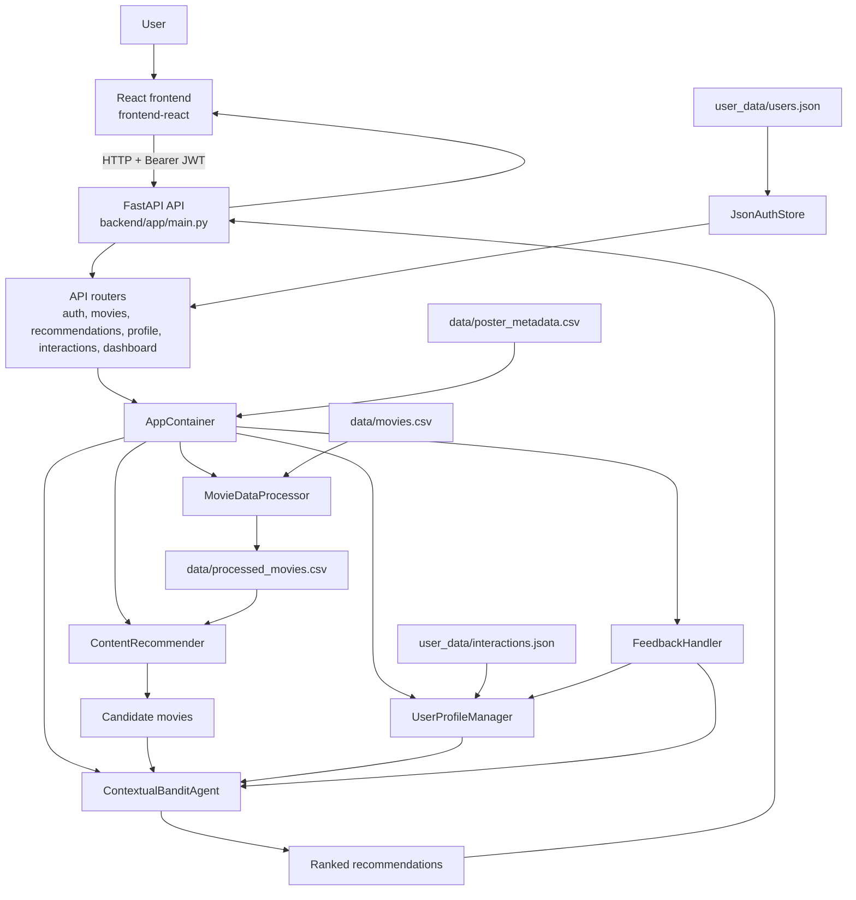

# MovieVerse System Architecture

## 1. Overview

MovieVerse is a full-stack movie recommendation prototype with a React client, a FastAPI service, and a Python recommendation engine. The current runtime is a three-layer system:

- **Presentation:** React + TypeScript + Vite + Tailwind CSS.
- **Application/API:** FastAPI routes, JWT authentication, service orchestration, and validation.
- **Recommendation/domain:** catalog preprocessing, TF-IDF candidate generation, RL-style reranking, profile state, and feedback.

The prototype uses local CSV and JSON files rather than a database. The original Streamlit app remains in `app.py`, but the active product path is React -> FastAPI -> Python recommendation services.

## 2. High-level architecture



## 3. End-to-end flow

### 3.1 App startup

`backend/app/main.py` creates the FastAPI app, configures CORS for the Vite origin, and registers the `/api` router. During the application lifespan it attaches two shared objects to `app.state`:

- `JsonAuthStore`, backed by `user_data/users.json`.
- `AppContainer`, built by `backend/app/infrastructure/container.py`.

The container loads the raw catalog, regenerates processed features, builds the content model, loads the RL artifact, merges poster metadata, and creates profile/feedback services.

### 3.2 Data loading and preprocessing

The preprocessing pipeline begins in `src/data_preprocessing.py`. It loads `data/movies.csv` and builds combined text features from movie metadata. The backend saves the processed data to `data/processed_movies.csv` during startup and uses it to build the similarity model.

### 3.3 Content-based candidate generation

The recommendation engine in `src/recommender.py` uses TF-IDF vectorization, cosine similarity, watched/excluded filtering, and preferred-genre candidate selection. This stage provides a relevant pool before personalization.

### 3.4 RL-style personalization

The RL layer in `src/rl_agent.py` learns genre preference signals over time. It uses genre-level Q-values and an epsilon-greedy policy to balance exploitation with exploration. It is an RL-inspired ranking layer, not a separate deep-learning model per user.

### 3.5 User profile and interaction storage

The profile system in `src/user_profile.py` persists preferred genres, watched movie IDs, ratings, watchlist IDs, and summary values to `user_data/interactions.json`.

Authentication is stored separately in `user_data/users.json` through `backend/app/infrastructure/auth_store.py`. Passwords are stored as Argon2 hashes; raw passwords are not written to disk.

### 3.6 Feedback loop

The rating schema accepts values from 1 through 5. `FeedbackHandler` maps the rating into a reward, updates interaction state, and updates genre preference values used by subsequent ranking calls.

### 3.7 Frontend interaction model

The React app stores the access token in `sessionStorage` and calls protected routes using bearer tokens. The default API base is `http://localhost:8000/api`; `VITE_API_URL` can override it for another backend port.

## 4. Layered architecture

### 4.1 Presentation layer

Files:

- `frontend-react/src/App.tsx`
- `frontend-react/src/components/*`
- `frontend-react/src/pages/*`
- `frontend-react/src/auth/authApi.ts`
- `frontend-react/src/lib/api.ts`

Responsibilities:

- Render auth, onboarding, navigation, movie, dashboard, and profile screens.
- Maintain frontend auth and page state.
- Load data from FastAPI and submit interaction actions.
- Provide loading, error, empty, and success feedback states.

### 4.2 API layer

Files:

- `backend/app/main.py`
- `backend/app/api/router.py`
- `backend/app/api/routes/*`
- `backend/app/schemas/*`

Responsibilities:

- Expose health, auth, catalog, recommendation, profile, dashboard, and interaction endpoints.
- Validate request and response shapes with Pydantic.
- Resolve JWT identities for protected routes.
- Coordinate reads and updates through the application container.

### 4.3 Service and domain layer

Files:

- `backend/app/services/catalog.py`
- `src/data_preprocessing.py`
- `src/recommender.py`
- `src/rl_agent.py`
- `src/user_profile.py`
- `src/feedback.py`

Responsibilities:

- Prepare catalog features.
- Generate candidate movies and similar titles.
- Rerank candidates using learned genre values.
- Maintain user interaction state.
- Convert ratings into learning feedback.

### 4.4 Data layer

Files:

- `data/movies.csv`
- `data/processed_movies.csv`
- `data/poster_metadata.csv`
- `user_data/users.json`
- `user_data/interactions.json`
- `models/content_model.pkl`
- `models/rl_agent.pkl`

Responsibilities:

- Persist the local catalog and generated features.
- Persist account and profile state.
- Provide saved model artifacts and optional poster URLs.

## 5. Authentication architecture

### Auth flow

1. The user opens the UI and chooses login, registration, or demo login.
2. The frontend sends credentials to `/api/auth/login`, `/api/auth/register`, or `/api/auth/demo`.
3. The backend validates or creates the account in `JsonAuthStore`.
4. The backend returns an HS256 JWT containing the user ID and expiry.
5. The frontend sends the token on protected requests.
6. FastAPI dependencies decode the token and provide the current user ID to route handlers.

The demo user is intentionally separate from normal account creation and is used for quick presentation/testing without a registration step.

## 6. Recommendation pipeline in detail

```text
User logs in
  -> frontend stores JWT
  -> frontend requests protected recommendations
  -> FastAPI resolves current user and shared AppContainer
  -> catalog service loads the user profile
  -> content layer selects genre-aware or fallback candidates
  -> watched movies are removed
  -> RL agent reranks candidates
  -> API returns movies with reasons and predicted scores
  -> React renders recommendation cards

User rates or saves a movie
  -> interaction route validates the request
  -> profile or feedback service updates JSON state
  -> rating feedback updates genre Q-values
  -> next recommendation request uses the updated state
```

## 7. API and module map

The router is mounted at `/api`.

| API group | Implemented behavior |
| --- | --- |
| `/health` | Service health response |
| `/auth` | Register, login, demo login, current user |
| `/movies` | Search, details, similar movies |
| `/recommendations` | Protected personalized list |
| `/profile` | Read profile and update preferred genres |
| `/interactions` | History, watchlist, watched, ratings |
| `/dashboard` | Watched/rated totals and genre preference values |

## 8. File structure

```text
MovieVerse/
├── backend/
│   └── app/
│       ├── api/routes/       HTTP route modules
│       ├── auth/             JWT and password helpers
│       ├── core/             Paths and development configuration
│       ├── infrastructure/  Auth store and ML container
│       ├── schemas/          Pydantic request/response models
│       ├── services/         Catalog and orchestration logic
│       └── main.py
├── frontend-react/
│   ├── src/
│   │   ├── auth/
│   │   ├── components/
│   │   ├── lib/
│   │   └── pages/
│   ├── package.json
│   └── vite.config.*
├── src/                      Recommendation domain logic
├── data/                     Catalog and poster metadata
├── models/                   Saved recommendation artifacts
├── user_data/                JSON auth and interaction state
├── scripts/                  Optional TMDB enrichment utility
├── app.py                    Legacy Streamlit entry point
├── requirements.txt
├── README.md
├── PROJECT_DOCUMENTATION.md
├── SYSTEM_ARCHITECTURE.md
└── .env.example
```

## 9. Why this architecture works

- The Python recommendation logic remains independent of the UI.
- FastAPI creates a clear, testable API boundary.
- React provides a modular product interface instead of coupling presentation to Python templates.
- Local files make the prototype easy to inspect, run, and demo.
- Authentication, user state, catalog data, and ranking responsibilities are separated clearly enough for a later database migration.

## 10. Current trade-offs

- JSON persistence is not suitable for concurrent production traffic or multi-instance deployment.
- The JWT secret and CORS origin are development-oriented configuration.
- The RL layer uses simple genre-level values and a shared in-process artifact.
- Poster metadata is optional and some catalog titles remain unmatched.
- The legacy Streamlit app creates a second, older presentation path.

## 11. Future evolution

The next architectural steps are a transactional database for auth/profile data, externalized configuration, refresh-token/session management, stronger production security, offline recommendation evaluation, richer user modeling, and deployment automation.
